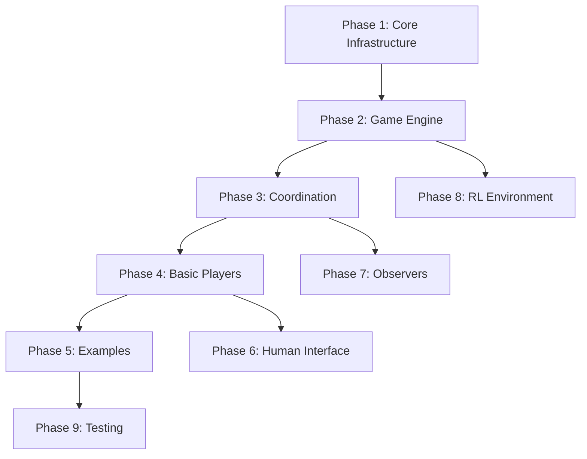

# Dice Wars AI - Complete Implementation Plan

This document provides a complete roadmap for implementing the Dice Wars AI system with a clean, minimal API design optimized for both human play and RL training.

## Project Structure

```
Dicewars_AI/
├── api.md                          # API design specification (already complete)
├── CLAUDE.md                       # This implementation plan
│
├── shared/                         # Shared components between all modules
│   ├── __init__.py                # Package initialization
│   ├── models.py                  # Data Transfer Objects (DTOs)
│   ├── interfaces.py              # Abstract interfaces (PlayerClient, GameObserver)
│   └── config.py                  # Configuration loading system
│
├── backend/                        # Core game engine
│   ├── __init__.py
│   ├── game_engine.py             # Main engine with 3 methods
│   ├── board.py                   # Hexagonal board and regions
│   ├── battle.py                  # Battle resolution logic
│   └── player_manager.py          # Player state management
│
├── coordinator/                    # Game orchestration
│   ├── __init__.py
│   └── game_coordinator.py        # Central hub managing all communication
│
├── clients/                        # Player implementations
│   ├── __init__.py
│   ├── ai/                        # AI players
│   │   ├── __init__.py
│   │   ├── base_ai.py            # Base class for all AIs
│   │   ├── random_ai.py          # Random action selection
│   │   ├── rule_based_ai.py      # Heuristic-based decisions
│   │   └── rl_agent_client.py    # Loads and uses trained models
│   │
│   └── human/                     # Human interfaces
│       ├── __init__.py
│       ├── terminal_client.py    # Text-based interface
│       └── gui/
│           ├── __init__.py
│           ├── gui_client.py     # Pygame GUI interface
│           └── renderer.py       # Board rendering utilities
│
├── observers/                      # Event logging and monitoring
│   ├── __init__.py
│   ├── console_observer.py       # Console output logging
│   ├── file_observer.py          # File-based logging
│   └── stats_observer.py         # Game statistics collection
│
├── rl/                            # Reinforcement learning training
│   ├── __init__.py
│   ├── environment.py             # Gymnasium-compatible environment
│   ├── agents/                    # RL algorithms
│   │   ├── __init__.py
│   │   ├── base_agent.py         # Abstract RL agent
│   │   ├── dqn.py               # Deep Q-Network implementation
│   │   └── ppo.py               # Proximal Policy Optimization
│   ├── train.py                   # Training orchestration
│   ├── evaluate.py               # Model evaluation
│   └── models/                    # Saved model checkpoints
│       └── .gitkeep
│
├── configs/                       # Game configurations
│   ├── presets/                  # Predefined game settings
│   │   ├── quick_test.json      # 5x5 board, 2 players
│   │   ├── balanced_classic.json # Standard 28x32 board
│   │   └── large_battle.json    # Large map variant
│   └── default.json              # Default configuration
│
├── examples/                      # Runnable example scripts
│   ├── __init__.py
│   ├── quick_test.py             # Quick 2-player test game
│   ├── human_vs_ai.py           # Interactive human vs AI
│   ├── ai_tournament.py         # AI round-robin tournament
│   └── watch_ai_battle.py       # Watch AIs play with visualization
│
├── tests/                        # Unit and integration tests
│   ├── __init__.py
│   ├── test_models.py           # DTO serialization tests
│   ├── test_engine.py           # Game engine logic tests
│   ├── test_coordinator.py      # Coordination flow tests
│   └── test_integration.py      # End-to-end game tests
│
├── requirements.txt              # Python dependencies
├── setup.py                      # Package installation
└── README.md                     # Project documentation
```

## Implementation Tasks Breakdown

### Phase 1: Core Infrastructure (Foundation)

#### Task 1.1: Create shared/models.py
**Goal**: Define all Data Transfer Objects
```python
# Required classes:
- GameState: regions, players, phase, turn_number, current_player_id, winner_id
- TurnContext: game_state, valid_actions, current_player_id
- ActionResult: success, new_game_state, battle_result, error_message
- RegionInfo: id, owner_id, dice_count, position, adjacent_region_ids
- PlayerInfo: id, name, color, territory_count, total_dice, is_alive
- Action, AttackAction, EndTurnAction (with stateless validation)
- BattleResult: combat outcome details
- GamePhase enum: SETUP, ATTACK, SUPPLY, GAME_OVER
- ActionType enum: ATTACK, END_TURN, SUPPLY
```
**Success Criteria**: All DTOs serialize/deserialize correctly to JSON

#### Task 1.2: Create shared/interfaces.py
**Goal**: Define abstract interfaces
```python
# Required interfaces:
- PlayerClient: get_action(), on_game_start(), on_battle_result(), on_game_end()
- GameObserver: on_turn_start(), on_action_executed(), on_invalid_action(), etc.
```
**Success Criteria**: Clean abstract interfaces with clear documentation

#### Task 1.3: Create shared/config.py
**Goal**: Configuration loading system
```python
# Required functionality:
- BoardConfig, GameplayConfig, GameConfig dataclasses
- load_preset(name) → GameConfig
- validate_config(config) → List[str]
- list_presets() → List[str]
```
**Success Criteria**: Can load and validate JSON config files

### Phase 2: Game Engine (Core Logic)

#### Task 2.1: Create backend/board.py
**Goal**: Square grid board implementation
```python
# Required classes:
- Coordinate: x, y position
- Region: id, cells, owner, dice_count, adjacent_regions
- SquareBoard: generate_random_regions(), get_region(), get_adjacent_regions()
```
**Success Criteria**: Can generate valid square grid board with connected regions

#### Task 2.2: Create backend/battle.py
**Goal**: Battle resolution system
```python
# Required functionality:
- BattleEngine: resolve_battle(attacker_dice, defender_dice) → BattleOutcome
- Dice rolling simulation
- Win probability calculations
```
**Success Criteria**: Battles resolve correctly with proper randomness

#### Task 2.3: Create backend/player_manager.py
**Goal**: Player state tracking
```python
# Required classes:
- Player: id, name, owned_regions, status
- PlayerManager: add_player(), get_current_player(), next_turn()
```
**Success Criteria**: Tracks player states and turn order correctly

#### Task 2.4: Create backend/game_engine.py
**Goal**: Main game engine with minimal API
```python
# Required methods (only 3!):
- initialize_game(player_ids: List[int])
- get_turn_context() → TurnContext
- apply_action(action: Action) → ActionResult

# Internal methods:
- _validate_action(), _execute_attack(), _distribute_supply()
- _check_win_condition(), _update_game_state()
```
**Success Criteria**: Complete game can be played via these 3 methods

### Phase 3: Game Coordination

#### Task 3.1: Create coordinator/game_coordinator.py
**Goal**: Central orchestration hub
```python
# Required functionality:
- register_player(client, name, player_type) → player_id
- add_observer(observer)
- start_game()
- run_game_loop() → winner_id
- Error handling and penalty application
```
**Success Criteria**: Coordinates complete game between engine and clients

### Phase 4: Basic Players

#### Task 4.1: Create clients/ai/base_ai.py
**Goal**: Base class for AI implementations
```python
# Required methods:
- Helper utilities for parsing game state
- Common AI functionality
```
**Success Criteria**: Provides useful base for AI implementations

#### Task 4.2: Create clients/ai/random_ai.py
**Goal**: Random action selection
```python
# Implementation:
- Randomly selects from valid_actions
- Optional aggression parameter for attack frequency
```
**Success Criteria**: Makes valid random moves

#### Task 4.3: Create clients/ai/rule_based_ai.py
**Goal**: Heuristic-based AI
```python
# Heuristics:
- Attack weakest neighbor
- Fortify borders
- Expand territory
```
**Success Criteria**: Plays reasonably well with simple rules

### Phase 5: Configuration & Examples

#### Task 5.1: Create config files
**Goal**: JSON configuration presets
```json
// quick_test.json:
{
  "name": "Quick Test",
  "board": {"width": 5, "height": 5, "region_count_target": 8},
  "gameplay": {"max_players": 2, "max_dice_per_region": 4}
}
```
**Success Criteria**: Valid config files for different game types

#### Task 5.2: Create examples/quick_test.py
**Goal**: Minimal working example
```python
# Functionality:
- Load config
- Create coordinator
- Register 2 RandomAIs
- Run game
- Print winner
```
**Success Criteria**: Complete game runs without errors

### Phase 6: Human Interface

#### Task 6.1: Create clients/human/terminal_client.py
**Goal**: Text-based interface
```python
# Features:
- Display board as ASCII
- List valid actions with numbers
- Accept user input
```
**Success Criteria**: Humans can play via terminal

#### Task 6.2: Create clients/human/gui/gui_client.py
**Goal**: Graphical interface
```python
# Features:
- Pygame-based visualization
- Click to select regions
- Visual feedback for battles
```
**Success Criteria**: Humans can play via GUI

### Phase 7: Observers

#### Task 7.1: Create observers/console_observer.py
**Goal**: Console logging
```python
# Logs:
- Turn starts/ends
- Actions executed
- Battle results
- Game outcomes
```
**Success Criteria**: Clear game flow in console

#### Task 7.2: Create observers/stats_observer.py
**Goal**: Statistics collection
```python
# Tracks:
- Game length
- Battle counts
- Territory changes
- Win rates
```
**Success Criteria**: Produces useful game statistics

### Phase 8: RL Environment

#### Task 8.1: Create rl/environment.py
**Goal**: Gymnasium-compatible environment
```python
# Required:
- DiceWarsEnv(gym.Env)
- observation_space, action_space
- step(), reset(), render()
- State to numpy conversion
```
**Success Criteria**: Compatible with standard RL libraries

#### Task 8.2: Create rl/agents/dqn.py
**Goal**: Deep Q-Network agent
```python
# Components:
- Neural network architecture
- Experience replay buffer
- Training loop
```
**Success Criteria**: Can train against random opponents

#### Task 8.3: Create rl/train.py
**Goal**: Training orchestration
```python
# Features:
- Hyperparameter configuration
- Training loop with logging
- Model checkpointing
```
**Success Criteria**: Trains and saves models

### Phase 9: Testing

#### Task 9.1: Create tests/test_models.py
**Goal**: DTO testing
```python
# Tests:
- Serialization/deserialization
- Validation logic
- Edge cases
```
**Success Criteria**: 100% coverage of model code

#### Task 9.2: Create tests/test_integration.py
**Goal**: End-to-end testing
```python
# Tests:
- Complete game scenarios
- Various player combinations
- Error conditions
```
**Success Criteria**: Games complete without errors

## Implementation Order & Dependencies



## Critical Success Metrics

1. **API Minimalism**: 
   - GameEngine: 3 methods
   - PlayerClient: 4 methods
   - No redundant methods

2. **Clean Separation**:
   - Engine knows nothing about clients
   - Clients know nothing about engine
   - All communication through coordinator

3. **Single Source of Truth**:
   - GameState contains all status
   - No duplicate information
   - No synchronization issues

4. **Performance**:
   - Single API call per turn
   - Minimal serialization overhead
   - Efficient board operations

5. **Extensibility**:
   - Easy to add new player types
   - Easy to add new observers
   - Easy to modify game rules

## Next Steps

1. Start with Phase 1 (shared module) - foundation for everything
2. Implement Phase 2 (backend) - core game logic
3. Test with Phase 3-5 (coordinator + basic AIs)
4. Add human interfaces (Phase 6) for interactive testing
5. Implement RL training (Phase 8) once core is stable

This plan provides a complete, implementable roadmap from empty directory to fully functional Dice Wars AI system.